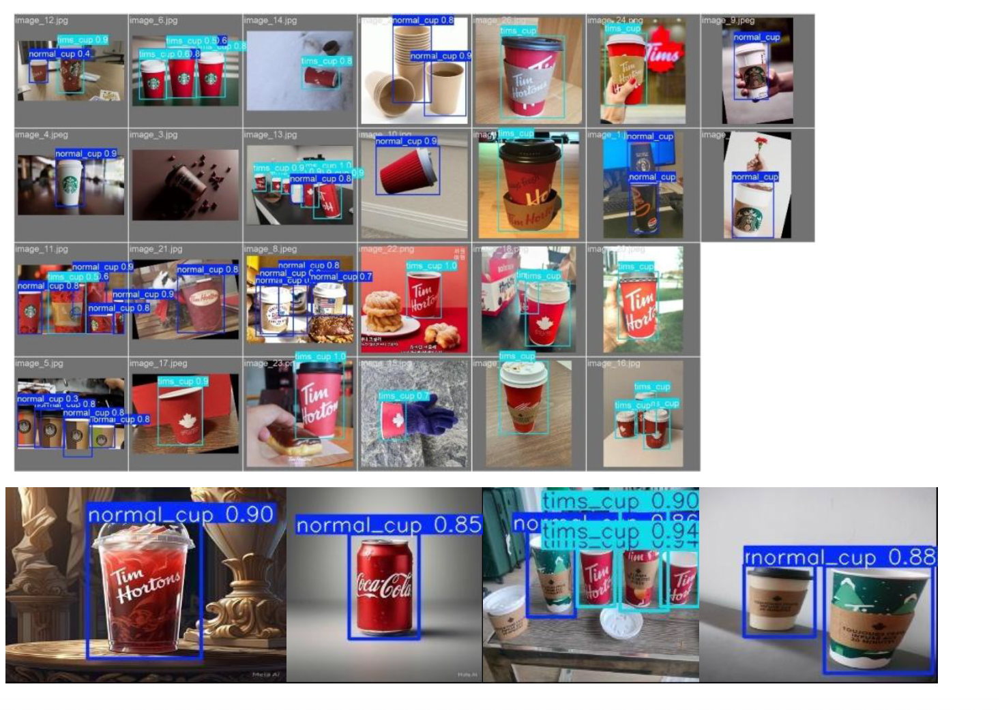
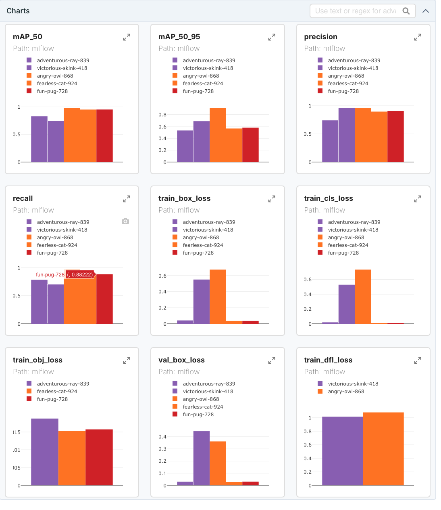

# Tim Hortons Cup Detection with YOLO Fine tunning

This project focused on deploying trained YOLO object detection models using a RESTful API. The system was designed to handle inference requests, support multiple models, and provide monitoring capabilities using tools like Grafana and Docker. A front-end UI was also built for user interaction.

